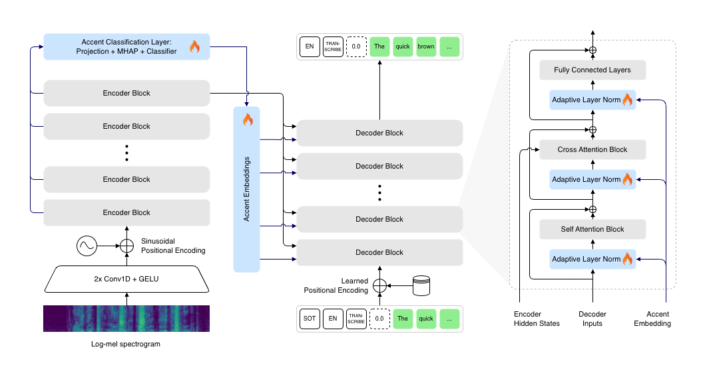

# Whisper Accent — Accent-Aware English Speech Recognition

**Make Whisper better at transcribing diverse English accents**
by conditioning the decoder on learnt accent embeddings via **Adaptive Layer Normalization (AdaLN)**.

Built on top of [OpenAI Whisper](https://github.com/openai/whisper) using [Hugging Face Transformers](https://github.com/huggingface/transformers).



*Accent embeddings are learnt independently and accent is predicted from encoder hidden states (layer-weighted fusion + multi-head attention pooling); these embeddings are then used to modulate decoder LayerNorms via Adaptive Layer Normalization*

---

## Why This Project?

English speech recognition still struggles with accent diversity even in state-of-the-art models like Whisper.

This project demonstrates how to lightweight-condition a frozen Whisper model on accent identity, achieving better word error rate (WER) across accents without full fine-tuning.

---

## Features

- Extends Whisper with per-accent conditioning via AdaLN in every decoder layer where the weights are trained with zero-initialization while the bias is initialized to pretrained LayerNorm gamma and beta values and frozen.
- Accent embeddings learnt for each accent independently and used to condition the decoder hidden states.
- Accents predicted from encoder hidden states via a classifier head:
  - Learnable weighted sum across all layers + input embeddings
  - Projection layer
  - Multi-head attention pooling over time
- Encoder & decoder remain completely frozen preserving the original generalization capability
- Only <10% of parameters are trainable (AdaLN modulation weights, accent embeddings, accent classifier)

**Supported accents**:

- American, British, Scottish, Irish, Canadian, Northern Irish
- Indian, Spanish, Dutch, German, Czech, Polish
- French, Italian, Hungarian, Finnish
- Vietnamese, Romanian, Slovak, Estonian, Lithuanian, Croatian, Slovene

---

## Quick Start

### Install

```bash
# Recommended: use conda
conda env create -f env.yml
conda activate whisper-accent

# Install pre-commit hooks (optional but recommended)
pre-commit install

# Login to Hugging Face (needed for model weights & some datasets)
huggingface-cli login

# Optional: Weights & Biases for logging
wandb login
```

### Training

```bash
# Trains accent classifier
bash scripts/train_accent_head.sh

# Trains decoder AdaLN layers and accent embeddings
bash scripts/train_decoder.sh
```

Both scripts use `accelerate launch` for multi-GPU / mixed-precision training.

### Evaluation

Single model:

```bash
python scripts/eval.py \
  --model_name_or_path your/checkpoint-or-hf-name \
  --dataset_name westbrook/English_Accent_DataSet \
  --split test \
  --batch_size 8 \
  --output path/to/output.json
```

Batch-evaluate multiple checkpoints:

```bash
bash scripts/eval_all.sh
```

Results include JSON with overall WER, per-accent WER, accent accuracy, and per-sample predictions.

---

## Training Procedure

Training follows a two-stage optimization scheme:

1. Stage 1: **Accent Classifier Training**
   - Initialization: The model is initialized from a pretrained English Whisper checkpoint (e.g. `openai/whisper-small.en`), and all encoder/decoder weights are kept fixed.
   - Trainable components:
     - Accent classification stack: layer-fusion weights over encoder representations, projection layer, multi-head attention pooling, and the final accent classifier.
   - Learning objective:
     - The model is optimized solely for accent classification with respect to the ground-truth accent labels (`lambda_ce = 0.0`, `lambda_accent = 1.0`).

2. Stage 2: **Decoder AdaLN + Accent Embeddings Training**
   - Initialization: The checkpoint obtained from Stage 1 is used as `base_model_name_or_path`.
   - Trainable components:
     - Decoder-side AdaLN modulation parameters
     - Accent embeddings, updated with a dedicated `embedding_learning_rate`
   - Learning objective:
     - The model is optimized only for automatic speech recognition using cross-entropy on reference transcripts (`lambda_ce = 1.0`, `lambda_accent = 0.0`).
     - Ground-truth accent labels are used to condition the decoder while training; Predicted accent labels are used at evaluation time.

---

## Project Structure

```
whisper-accent/
├── src/
│   ├── model/               # WhisperAccentModel, AccentClassifier, AdaLN layers
│   ├── train/               # Dataset, data collator, custom Trainer
│   ├── utils/
│   └── constants.py
├── scripts/
│   ├── train_accent_head.sh # Launch accent classifier training with accelerate config
│   ├── train_decoder.sh     # Launch decoder AdaLN + accent embeddings training with accelerate config
│   ├── eval.py              # Single-model evaluation
│   └── eval_all.sh          # Batch evaluation across models
├── assets/                  # architecture.png, sample results
├── env.yml
├── pyproject.toml
└── README.md
```

---

## Advanced Usage & Tips

- Frozen backbone: Encoder and decoder parameters inherited from Whisper remain fixed throughout both stages of training. It is recommended to set dropout in these frozen components to 0.0 during training for stable convergence.
- Stage-specific hyperparameters:
  - Stage 1: Accent Classifier Training:
    - `lambda_ce = 0.0`, `lambda_accent = 1.0` (pure accent-classification supervision).
    - `learning_rate`: comparatively larger learning rate is used for the accent-classification stack (1e-3 used for small and medium models).
    - `accent_class_weights`: class weights are passed in the model config to handle imbalanced accent classes.
  - Stage 2: Decoder AdaLN + Accent Embeddings Training:
    - `lambda_ce = 1.0`, `lambda_accent = 0.0` (pure ASR supervision).
    - `learning_rate`: primary optimizer learning rate for the decoder AdaLN layers (5e-5 used for small and medium models).
    - `embedding_learning_rate`: separate learning rate for the accent embeddings (5e-4 used for small and medium models).
    - `weight_decay = 0.0`: weight decay is disabled since the decoder AdaLN layers are already zero-initialized.
- Custom datasets: Any dataset with `audio`, `raw_text`, and `accent` fields can be employed, provided that an appropriate accent-label mapping is defined in the data pipeline.

---

## License

Model weights: inherit from original Whisper (Apache 2.0)

---
